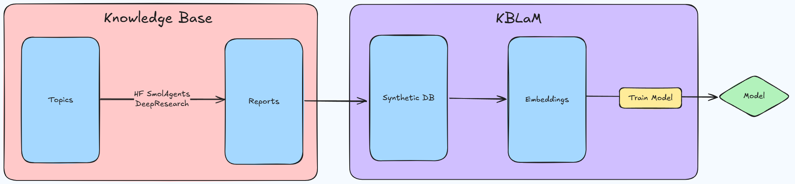

# UroKLaMP: Urología Knowledge-based Language Model Pipeline

[](https://opensource.org/licenses/Apache-2.0)
[](https://www.python.org/downloads/)
[](CONTRIBUTING.md)
[](https://huggingface.co/)
[]()

## 📌 Resumen

UroKBLaM es un proyecto de código abierto diseñado para crear modelos de lenguaje especializados en el campo de la urología, utilizando tecnologías avanzadas como [smolagents](https://github.com/huggingface/smolagents) y [KBLaM](https://github.com/microsoft/KBLaM) (Knowledge-Based Language Models). Este proyecto aprovecha recursos existentes de formación especializada en urología (FEA) y los enriquece mediante investigación automatizada profunda para crear un sistema de asistencia inteligente para profesionales médicos.

## 🔍 Visión general

<p align="center">
  
</p>

El desarrollo de UroKLaMP sigue un proceso riguroso dividido en dos fases principales:

### Fase 1: Construcción de la base de conocimiento
- **Origen de datos**: Temas especializados de urología provenientes de programas FEA (Formación Especializada Avanzada)
- **Enriquecimiento**: Aplicación de `smolagents` de Hugging Face con DeepResearch para ampliar y profundizar el conocimiento base
- **Generación de informes**: Creación sistemática de documentos estructurados que capturan el conocimiento especializado

### Fase 2: Desarrollo del modelo (KBLaM)
- **Generación de datos sintéticos**: Transformación de los informes en formato pregunta-respuesta para facilitar el aprendizaje
- **Vectorización**: Conversión del conocimiento en embeddings de alta dimensionalidad
- **Entrenamiento**: Optimización de un modelo de lenguaje especializado usando las representaciones vectoriales

Este enfoque bidireccional nos permite crear un asistente médico que combina conocimiento especializado con capacidades avanzadas de procesamiento de lenguaje natural.

## ⚙️ Instalación

### Requisitos previos
- Python 3.8 o superior
- pip (administrador de paquetes de Python)
- Acceso a GPU recomendado para entrenamientos eficientes

### Instalación básica

```bash
# Clonar el repositorio
git clone https://github.com/tu-usuario/create_model_urology_klamp.git
cd create_model_urology_klamp

# Crear y activar un entorno virtual (recomendado)
python -m venv venv
# En Windows
venv\Scripts\activate
# En Unix o MacOS
source venv/bin/activate

# Instalar dependencias
pip install -r requirements.txt

# Instalar smolagents
pip install smolagents
```

## 🚀 Uso

### Procesamiento de temas

```bash
python process_topics.py --input topics.md --output reports/
```

### Ejecución de investigación profunda

```bash
python -m smolagents.examples.open_deep_research.run --topics ./topics.md --output ./reports
```

### Visualización de resultados

```bash
python -m smolagents.examples.open_deep_research.analysis --reports_dir ./reports
```

## 📊 Flujo de trabajo

1. **Preparación de temas**: Define los temas urológicos de interés en `topics.md`
2. **Investigación automatizada**: Ejecuta el proceso DeepResearch para ampliar el conocimiento
3. **Generación de informes**: Almacena los resultados en la carpeta `reports/`
4. **Creación de datos sintéticos**: Utiliza KBLaM para generar pares pregunta-respuesta
5. **Entrenamiento del modelo**: Integra los embeddings para entrenar el modelo final

## 👥 Comunidad y contribución

UroKLaMP es un proyecto comunitario que busca mejorar el acceso a conocimientos especializados en urología. Agradecemos contribuciones de diferentes tipos:

- 🐛 Reportes de errores mediante issues
- 💡 Sugerencias de nuevas funcionalidades
- 📝 Mejoras en la documentación
- 💻 Pull requests con código

Por favor, consulta [CONTRIBUTING.md](CONTRIBUTING.md) para más detalles sobre cómo contribuir.

## 📚 Recursos

- [Repositorio de smolagents](https://github.com/huggingface/smolagents)
- [SmolAgents DeepResearch](https://github.com/huggingface/smolagents/tree/main/examples/open_deep_research)
- [Documentación de KBLaM](https://github.com/microsoft/KBLaM)
- [Guía de embeddings](https://huggingface.co/learn/nlp-course/chapter5/1)

## 📋 Roadmap

- [x] Ampliar la base de datos de temas urológicos
- [ ] Implementar evaluación automática de calidad de informes
- [ ] Desarrollar interfaz web para consultas al modelo
- [ ] Integrar capacidades multimodales (análisis de imágenes médicas)
- [ ] Publicar modelo entrenado en Hugging Face Hub

## 📄 Licencia

Este proyecto está licenciado bajo la [Licencia Apache 2.0](LICENSE) - consulta el archivo LICENSE para más detalles.

## 🙏 Agradecimientos

Agradecemos a la comunidad de Hugging Face, a Microsoft por el desarrollo de KBLaM, y a todos los profesionales médicos que han compartido su conocimiento para hacer posible este proyecto.

---

<p align="center">
  <i>Desarrollado con ❤️ por la comunidad para la comunidad médica</i>
</p>

